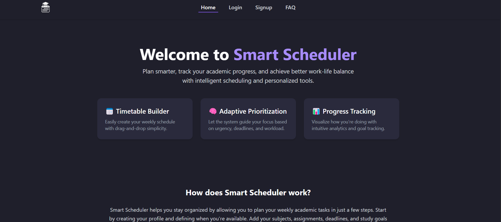
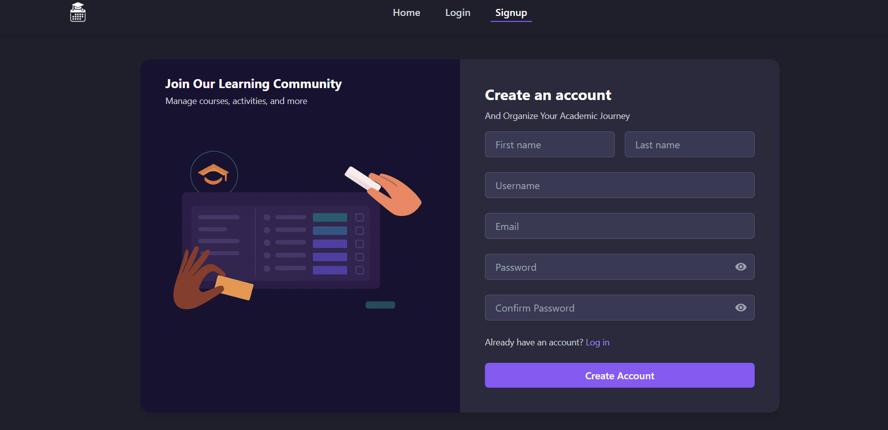
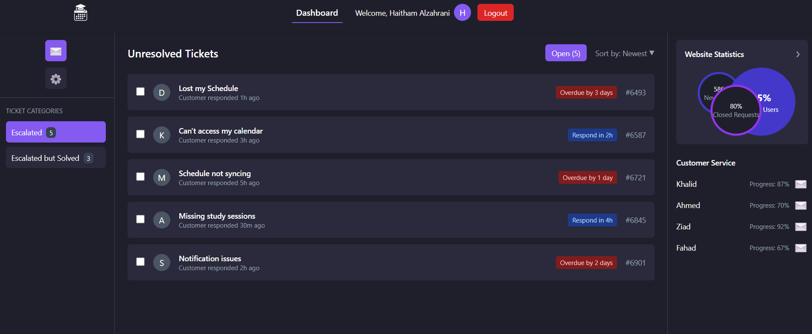
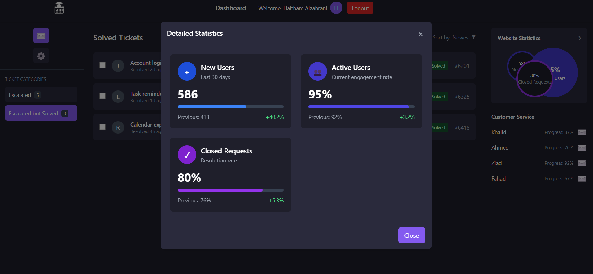
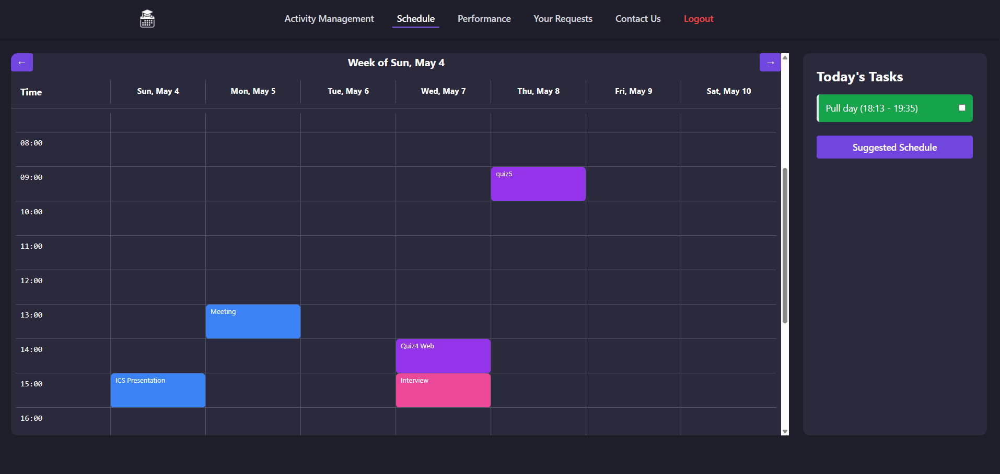
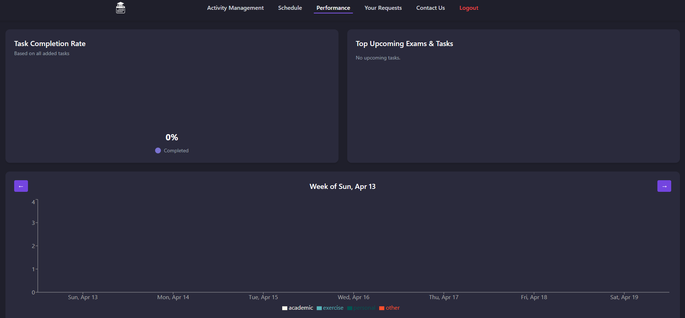
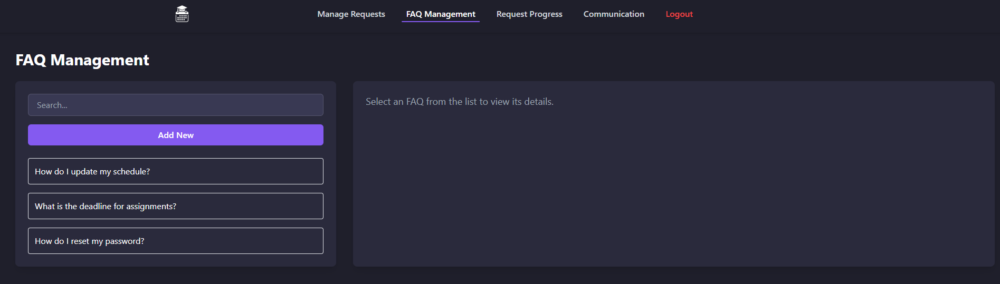
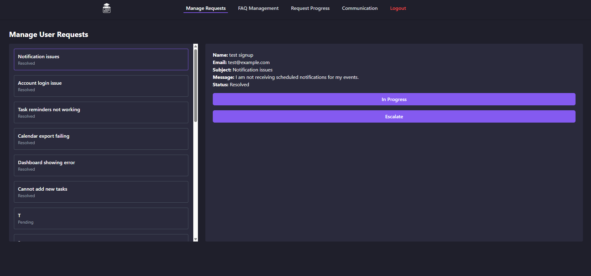

#  Smart Scheduler

A full-stack scheduling assistant built for the SWE 363 course. This project helps users manage their time and schedule smartly, using a **React frontend styled with Tailwind CSS**, a Node.js backend, and (soon) MongoDB database.

---

## 📁 Project Structure

```plaintext
smart-scheduler/
├── client/                         # React frontend
│   ├── public/
│   │   ├── favicon.ico
│   │   ├── index.html
│   │   └── robots.txt
│   ├── src/
│   │   ├── components/             # Reusable UI components
│   │   ├── pages/                  # Full screen/page views
│   │   ├── assets/                 # Images, logos, etc.
│   │   ├── App.js
│   │   ├── App.css
│   │   ├── index.js
│   │   └── index.css
│   ├── package.json
│   └── .gitignore
├── server/                         # Node.js + Express backend
│   ├── routes/
│   ├── .env                        # Environment variables (ignored by Git)
│   ├── .env.example                # Template for teammates
│   ├── server.js
│   ├── package.json
│   └── .gitignore
├── README.md
└── .gitignore                      # (optional) Root-level ignore file
```

---

## Getting Started (Frontend Only – Phase 4)

### Prerequisites
- Node.js
- npm
- Git

---
## 📥 Step 1: Clone the Project

Run the following commands to clone the repository and set up the frontend:

```bash
git clone https://github.com/Ali-Mashni/smart-scheduler.git  
cd smart-scheduler/client
```

---

## 💻 Step 2: Install and Run the Frontend (React)

Install the necessary dependencies and start the development server:

```bash
npm install  
npm start
```

This will launch the React app locally at:  
`http://localhost:3000`

---
## 🔧 Step 3: Run the Backend (Node.js + Express)

> ⚠️ **Note for Graders:** The `.env.example` file included in this repository contains real credentials for evaluation purposes. These secrets will be **rotated after grading**.

Open a new terminal, then:

1. Navigate to the backend folder:

```bash

cd server
```

2. Create a `.env` file using the example:

- On Linux/macOS:

```bash

cp .env.example .env
```

- On Windows:

```bash
copy .env.example .env
```

3. Install backend dependencies:

```bash

npm install
```

4. Start the backend server:

```bash

node server.js
```

This will run the backend at:  
**http://localhost:5050** (or the port defined in `.env`)

> ✅ Make sure both the **frontend (on port 3000)** and **backend (on port 5050)** are running at the same time.

---
## 🧪 Usage Instructions and Examples

After launching the app (`npm start`), your browser will automatically open to the **Home Page**:



From here, users can:

- Explore the content of the homepage
- Navigate using the top navigation bar to access:
  - `Login`
  - `Signup`
  - `FAQ`

---

### 🔐 Login Behavior

The system uses **hardcoded mock users** for demonstration in Phase 5. Depending on the login credentials, users are redirected to their respective dashboards.

#### ✅ Most Important Credentials

| Role             | Email                            | Password | Redirected Page       |
|------------------|----------------------------------|----------|------------------------|
| Admin            | `admin@test.com`                 | `123`    | `/admin`              |
| Student (User)   | `t@t.com`                   | `12345678`    | `/schedule`           |
| Customer Service | `khaledsupport2@example.com`     | `1234`   | `/faq-management`     |

> 🔒 **Note:** You can only register as a **Student** using the Signup form.  
> Admin and Customer Service accounts are pre-seeded and cannot be created manually.

**To test:**

1. Click `Login` from the navigation bar  
2. Enter one of the email/password combinations listed above  
3. You will be redirected to the corresponding dashboard

> ⚠️ This login mechanism is **mock-only** and will be replaced by real backend authentication in future development phases.

---

### 🧭 Role-Based Walkthrough (With Examples)

#### 📝 Signup Page

The **Signup Page** offers a responsive, two-panel layout with real-time input validation. It supports only **Student** registration and checks for:

- Required fields being filled
- Valid email formatting
- Password length (min. 8 characters)
- Matching password confirmation



---

#### 🛠️ Admin Interface

1. Go to the `Login` page.
2. Use the following credentials:
   - **Email**: `admin@test.com`  
   - **Password**: `123`
3. You will be redirected to the **Admin Dashboard** at `/admin`.

Example screenshots:

- 
- 

---

#### 🎓 Student Interface

1. Go to the `Login` page.
2. Use the following credentials:
   - **Email**: `t@t.com`  
   - **Password**: `12345678`
3. You will be redirected to the **Student Schedule Page** at `/schedule`.

Example screenshots:

- 
- 

---

#### 💬 Customer Service Interface

1. Go to the `Login` page.
2. Use the following credentials:
   - **Email**: `khaledsupport2@example.com`  
   - **Password**: `1234`
3. You will be redirected to the **FAQ Management Page** at `/faq-management`.

Example screenshots:

- 
- 

##  Team Members

| Name               | Role / Contribution                                                                 |
|--------------------|--------------------------------------------------------------------------------------|
| Ali Mashni         | Project Integration, Home Page, Login & Signup Implementation                       |
| Khalid Alshehri    | Student Pages Development                                                            |
| Sultan Alatawi     | Student Pages Development                                                            |
| Haitham Alzahrani    | Admin Pages Development                                                              |
| Fahad Alathel      | Customer Service Pages Implementation                                                |
---


